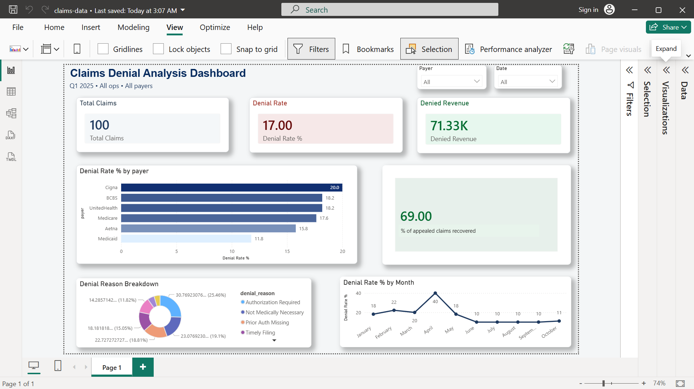

# Claims Denial Analysis Dashboard

## Business Problem
A hospital is losing revenue due to high insurance claim denials.
This dashboard helps the RCM team find the root cause.

## Key Findings
- Overall denial rate: 17%
- Cigna has the highest denial rate
- Authorization Required is the #1 denial reason
- 69% of appealed claims were recovered

## Tools
Excel · Power BI

## Dashboard Preview

## Files
- claims_data.xlsx — dataset
- dashboard.png — Power BI screenshot# claims-denial-analysis
